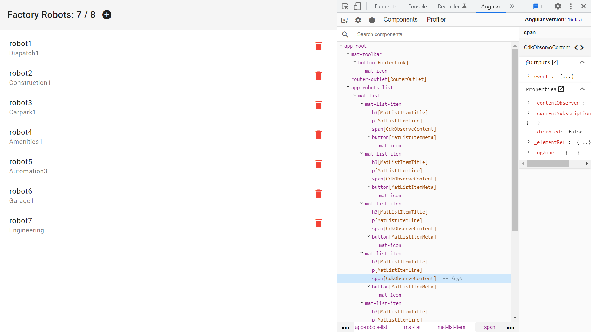

# :zap: Angular Signals Database

* App using [Angular signals](https://angular.io/guide/signals) and the [Angular Material design component library](https://material.angular.io/) to display and add items to a list.
* **Note:** to open web links in a new window use: _ctrl+click on link_


## :page_facing_up: Table of contents

* [:zap: Angular Signals Database](#zap-angular-signals-database)
  * [:page\_facing\_up: Table of contents](#page_facing_up-table-of-contents)
  * [:books: General info](#books-general-info)
  * [:camera: Screenshots](#camera-screenshots)
  * [:signal\_strength: Technologies](#signal_strength-technologies)
  * [:floppy\_disk: Setup](#floppy_disk-setup)
  * [:computer: Code Examples](#computer-code-examples)
  * [:cool: Features](#cool-features)
  * [:clipboard: Status \& To-Do List](#clipboard-status--to-do-list)
  * [:clap: Inspiration](#clap-inspiration)
  * [:file\_folder: License](#file_folder-license)
  * [:envelope: Contact](#envelope-contact)

## :books: General info

* Angular Material list of robots, showing name, work area & code

## :camera: Screenshots



## :signal_strength: Technologies

* [Angular v17](https://angular.io/)
* [Angular Material v17](https://material.angular.io/)
* [Angular signals](https://angular.io/guide/signals)

## :floppy_disk: Setup

* Install dependencies using `npm i`
* Run `ng serve` for a dev server. Navigate to `http://localhost:4200/`. The app will automatically reload if you change any of the source files.

* Run `ng build` to build the project. The build artifacts will be stored in the `dist/` directory.

## :computer: Code Examples

* functions from `robots.service.ts` to add qnd delete robots

```typescript
  addRobot(newRobot: Robot): void {
    setTimeout(() => {
      this.robots.update((robots) => [newRobot, ...robots]);
      this.router.navigate(['/']);
    }, 500);
  }

  deleteRobot(code: string): void {
    setTimeout(() => {
      this.robots.update((robots) => robots.filter((rob) => rob.code !== code));
    }, 500);
  }
```

## :cool: Features

* Angular signals means less code and avoids having to check the entire component tree when there is a state change in just one part of the tree. Presumably Zone.js will be removed from the Angular core bundle once Signals becomes standard.

## :clipboard: Status & To-Do List

* Status: Working
* To-Do: Nothing

## :clap: Inspiration

* [Angular Signals documentation](https://angular.io/guide/signals).

## :file_folder: License

* This project is licensed under the terms of the MIT license.

## :envelope: Contact

* Repo created by [ABateman](https://github.com/AndrewJBateman), email: `gomezbateman@gmail.com`
